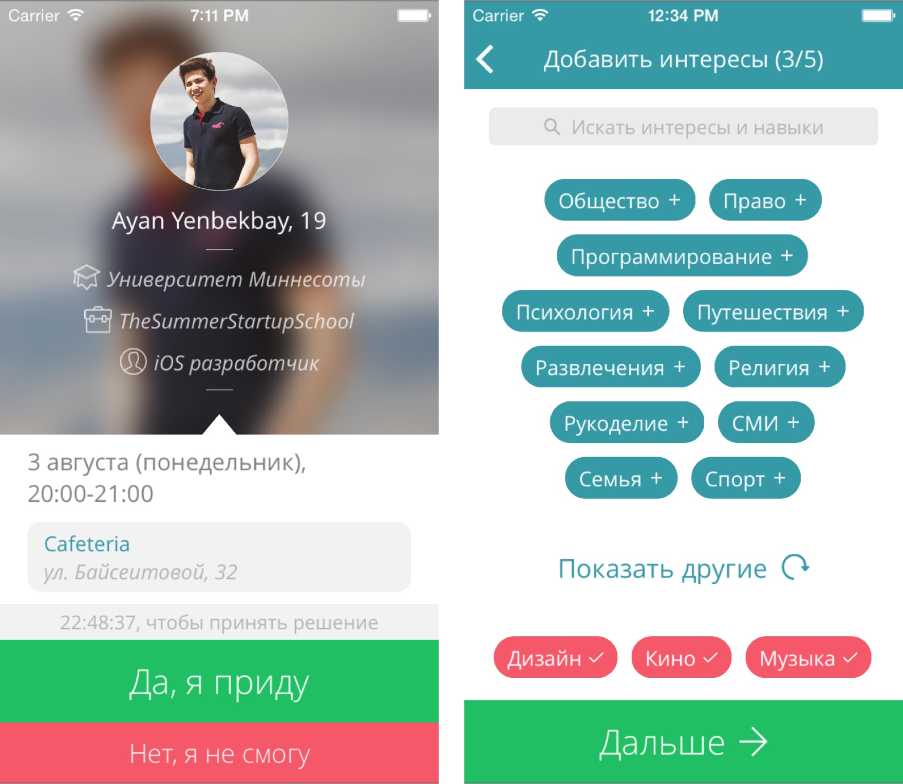

# Never Drink Alone

Never Drink Alone is an iOS app that gives you a chance to meet interesting people in your city. It sends you one meeting proposal a day and you can either accept it or reject it.



## Language

Never Drink Alone iOS code is written in Objective-C.

## Setup

1. Clone the repo

```bash
$ git clone https://github.com/yenbekbay/never-drink-alone
$ cd never-drink-alone
```

2. Install dependencies from [CocoaPods](http://cocoapods.org/#install)

```bash
$ cd ios && pod install
```

3. Open the Xcode workspace at `ios/NeverDrinkAlone.xcworkspace`.

## Cloud Code

This repo comes bundled with Parse Cloud Code, which used to run on Parse BaaS. Unfortunately, Parse [was shut down](http://blog.parse.com/announcements/moving-on/), so this setup is not going to be functional.
You can however use the source code for you learning purposes or modify it to build a backend on [Parse Server](https://github.com/ParsePlatform/parse-server).

## License

[MIT License](./LICENSE) © Ayan Yenbekbay
